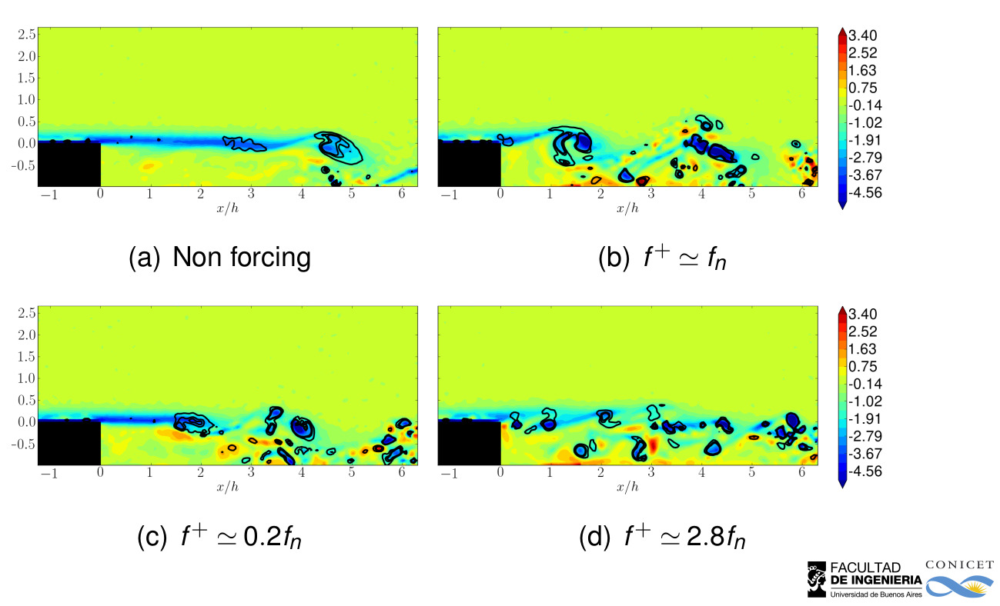
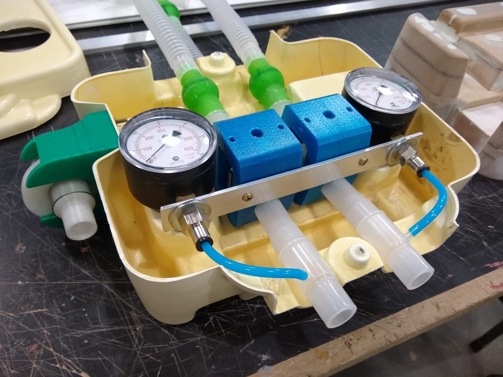

|-----------------------|-------|
| **Fluid Structure Interactions**:  | <video width="480" height="320" autoplay loop controls="controls"><source src='./flexible_flap.mp4' type="video/mp4"></video>|
| **Electrohydrodynamics**:  | <video width="480" height="320" autoplay loop controls="controls"><source src='./dbd_starting.mp4' type="video/mp4"></video>|
| **Hydrodynamical Instabilities**:  | <video width="480" height="320" autoplay loop controls="controls"><source src='./vortex2.mp4' type="video/mp4"></video>|
| **Reduced Order Models**:  | <video width="480" height="320" autoplay loop controls="controls"><source src='./cluster_ted.mp4' type="video/mp4"></video>|
| **Flow Control**:  | |
| **COVID 19**:  | |

